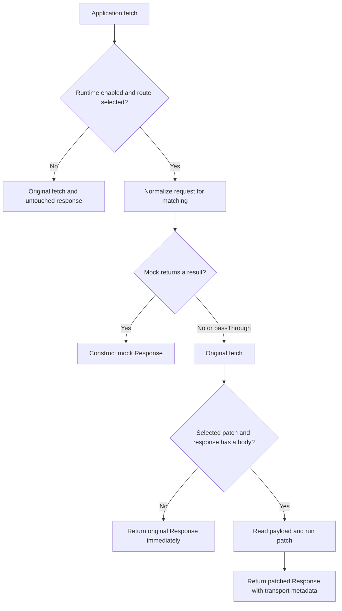

# API scenario runtime: scope and behavior

## Purpose

`@uiwwsw/test-mode` lets a running application reproduce API-driven UI states without changing the production API or hardcoding temporary branches into UI components. Developers define transport behaviors; QA selects named scenarios in the browser. A visible overlay indicates active test mode on relevant pages.

A scenario is a configuration, not an automated test. The library does not make assertions, decide pass/fail, run a browser, host an API, seed a database, or reset application caches. An application or external test runner must trigger a new request after changing scenarios.

## Request lifecycle

The original request arguments are retained for transport. `mapRequest` only changes the runtime's view of the request. Unmatched streams are not cloned or buffered. A selected patch buffers its response to expose a complete payload; do not select patches for infinite SSE streams. Explicit binary content types yield an ArrayBuffer; JSON/text payloads are parsed as JSON when possible, otherwise passed as text. URL, status, redirect/type metadata and application headers survive a patch, including cloning. Byte length, encoding and digest/ETag headers are discarded because their original values no longer describe the payload.

Mock and patch features are alternative behaviors for a matching path/method/case. Ambiguous duplicates are rejected. For overlapping patterns with different keys, active keys are visited in sorted order and the first matching definition wins; avoid overlapping patterns when order would matter. Custom match functions should be pure because the adapter can check a match before reading the body and again before executing a handler.

## Modules

| Area | Responsibility |
| --- | --- |
| `src/index.ts`: TestMode | Definitions, validation, route/case matching, active state, counters, stories, server integration |
| `src/index.ts`: browser helpers | Console API, extensions, page-aware overlay, subscriptions, installation and cleanup |
| `src/fetch.ts` | Request/Response adaptation, transport preservation, cancellation, fetch installation |
| `templates/test-mode` | App-owned example definitions, environment configuration and bootstrap |
| `tests` | Runtime and release regression tests using Node's test runner |
| `tests/browser` | Chromium integration of the published ESM build |
| `scripts/check-package.mjs` | Tarball contents, independent install, public exports and consumer type validation |
| `.github/workflows` | Repeatable verification and guarded npm publication |

The runtime has no external dependencies and no import-time DOM or fetch mutation. Package exports remain a single ESM entry. Sources are shipped with source maps and declaration maps for debugging.

## State and environment

Activation defaults to `NODE_ENV=development` or `NODE_ENV=test`. Browsers without `process` must explicitly supply an `enabled` condition. Storage entries cannot enable a disabled runtime. An app can supply a function if availability needs to be evaluated at request time.

The browser prefers localStorage and uses cookies for handoff/fallback. Each runtime also maintains an in-memory fallback for denied persistence or quota failure. Browser subscribers receive one notification per local change; instances sharing the configured event name can refresh from storage. Use distinct storage, cookie and event names for independent runtimes on one origin. Defaults are `test-mode.entries`, `test-mode:change`, and console namespace `__testMode`.

Without a browser, an instance owns its active state in memory. For shared SSR/server instances, always pass the incoming cookie header (including the empty string when absent) to `resolve`/`applyPatch`. Request counters belong to the runtime instance and entry, so use separate instances if per-request or per-session sequencing is required. This library does not interpret a test-mode cookie as an authentication credential.

## Contracts

- GET/HEAD use query parameters as `body`/`request`; DELETE and other body-capable methods expose their body. Query params are not route-param extraction.
- `RequestInit.headers` replaces Request headers. Reading a Request body for mocking does not consume the original input used by the network adapter.
- `resolve()` returns an HTTP result envelope or null for no match/pass-through. Handler exceptions reject; they are not silently converted to network requests.
- `applyPatch()` returns `{ data }`, including `{ data: null }`, or null for no match. `patch()` is the older payload-only API with an ambiguous null sentinel.
- A mock response can be JSON, text or a native BodyInit value. HEAD/204/205/304 remain bodyless. Opaque responses and bodyless upstream responses bypass patching.
- Abort signals reject waiting callers promptly, including while an asynchronous mock is pending. Arbitrary user handler side effects cannot be forcibly cancelled.
- Selecting a case removes all selected cases that conflict on path and HTTP method. Story registration rejects conflicting cases and missing/duplicate metadata or unknown entries. Failed registration does not partially mutate the existing catalog.
- Selecting a story replaces active feature entries; adding a story preserves compatible entries. Story removal removes its referenced entries even if another story also references them.
- `pages` controls discovery and overlay visibility, not whether an API is intercepted. A feature without pages is global; a story must have explicit or inherited pages.
- Fetch cleanup restores the exact previous function and tolerates nested installs removed in either order. It does not overwrite a newer third-party hook.
- Overlay cleanup removes the DOM, dataset markers, subscriptions and scheduled navigation refresh. Browser bootstrap should install one overlay/console per configured namespace and run its cleanup on teardown.

## Compatibility changes before the first registry release

The source-only scaffold used Dominos-specific storage/event names and assumed an absent NODE_ENV meant development. The first registry release uses neutral names and explicit development/test activation. Existing scaffold adopters can supply the old keys explicitly to retain saved scenarios. A global browser runtime must now set `enabled` deliberately.

## Release contract

A release must have an existing `v<package.version>` tag, matching lockfile versions, and a commit included in `origin/main`. Runtime, packaging and browser checks must all pass before the publish job can run. Stable versions use npm's latest channel; prereleases use next. A GitHub release's prerelease flag must agree with the version. Publish credentials are only exposed to the publish step; checkout credentials are not persisted. npm publication is immutable, so changes after a release need a new version.

References: [Fetch standard](https://fetch.spec.whatwg.org/), [npm publishing](https://docs.npmjs.com/cli/v11/commands/npm-publish/), [npm trusted publishing](https://docs.npmjs.com/trusted-publishers/).
